# DirectX 12 3D Tank Shooting Game

<div align="center">
  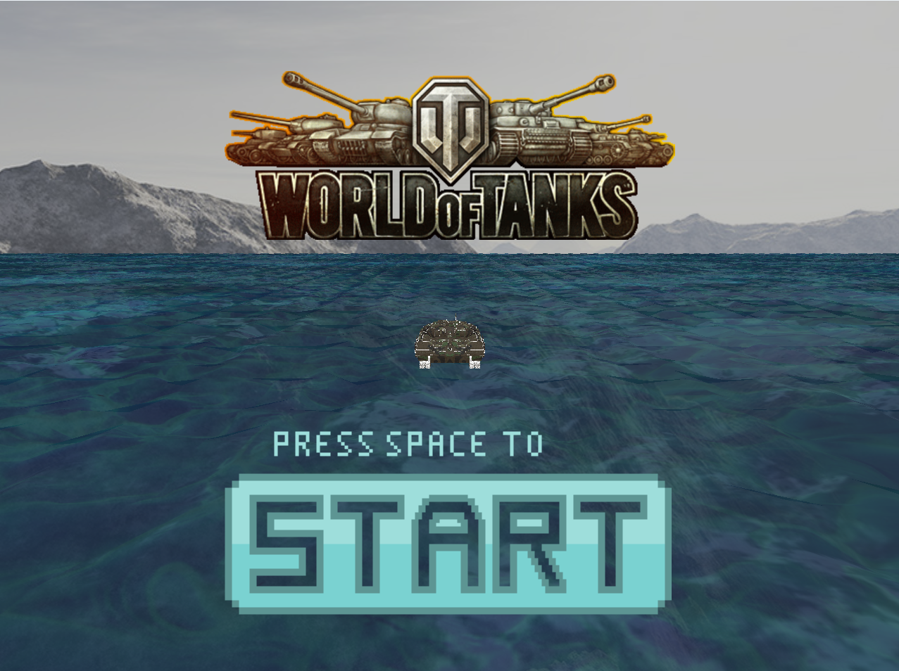
  <br><br>
  <strong>3D 게임프로그래밍2 과제 #01 &nbsp;|&nbsp; 2019184016 서정원</strong>
</div>

---

## 프로젝트 소개

DirectX 12를 직접 다루며 구현한 3D 탱크 슈팅 게임입니다.

렌더링 파이프라인 설정, HLSL 셰이더 작성, 충돌 처리, UI까지 외부 3D 엔진 없이 C++과 DirectX 12로 직접 구현했습니다.  
게임 목표는 **3분 안에 맵 곳곳에 배치된 적 탱크 7대를 모두 격파**하는 것입니다.

<div align="center">
  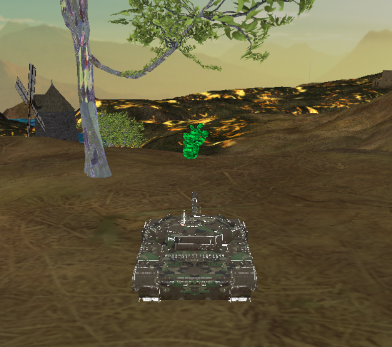
  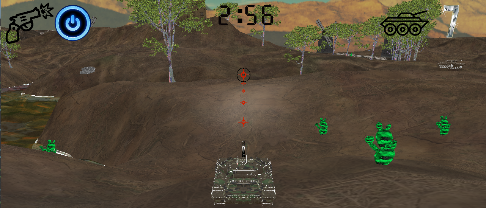
</div>

---

## 개발 환경

| 항목 | 내용 |
|------|------|
| 언어 | C++, HLSL |
| 그래픽 API | DirectX 12 |
| 2D UI | Direct2D (Direct2D11on12) |
| 사운드 | FMOD |
| 모델 추출 | Unity |
| 텍스처 포맷 | DDS |
| IDE | Visual Studio |
| 플랫폼 | Windows 10/11 x64 |

---

## 실행 방법

**요구 사항**
- Windows 10 또는 11
- DirectX 12 지원 GPU
- Visual Studio 2019 이상

**빌드**
1. `3DGP2_Assignment01.sln` 을 Visual Studio로 열기
2. 구성: `x64 / Release` 선택
3. 빌드 실행

**실행**
- `x64/Release/` 폴더에서 실행 파일 실행
- `fmod.dll`, `fmodL.dll` 이 실행 파일과 같은 폴더에 있어야 합니다

---

## 조작법

**이동**

| 키 | 동작 |
|----|------|
| ↑ / ↓ | 전진 / 후진 |
| ← / → | 차체 좌/우 회전 |
| 좌 Shift | 가속 이동 (진흙 상태일 때 불가) |

**포탑 조준**

| 키 | 동작 |
|----|------|
| A / D | 터렛 좌/우 회전 |
| W / S | 포신 상/하 각도 조절 |

**전투 및 기능**

| 키 | 아이콘 | 동작 |
|----|--------|------|
| Space | | 발사 |
| Q |  | 단발 모드 — 발사 시 카메라가 미사일 추적 |
| E | 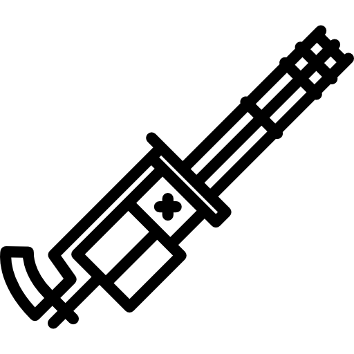 | 연발 모드 — 0.3초 간격 연속 발사 |
| R |  | 적 위치 탐지 — 2.5초간 파란 조명 표시, 쿨타임 5초 |
| F | | 조준점 모드 변경 (3가지 순환) |

---

## 게임 흐름

```
시작 화면 (Space 입력)
    ↓
게임 씬 시작 (제한 시간 3분)
    ↓
적 탱크 7대 격파 → 승리
제한 시간 초과    → 패배
    ↓
엔딩 씬 (점수 표시)
```

- 게임 중 **10초 간격**으로 지형이 진흙 상태로 전환됩니다
- 진흙 상태에서는 이동 속도 감소, 가속 불가
- 일반 상태에서는 Shift로 가속 이동 가능
- 탱크는 미사일 1발에 격파됩니다

<div align="center">
  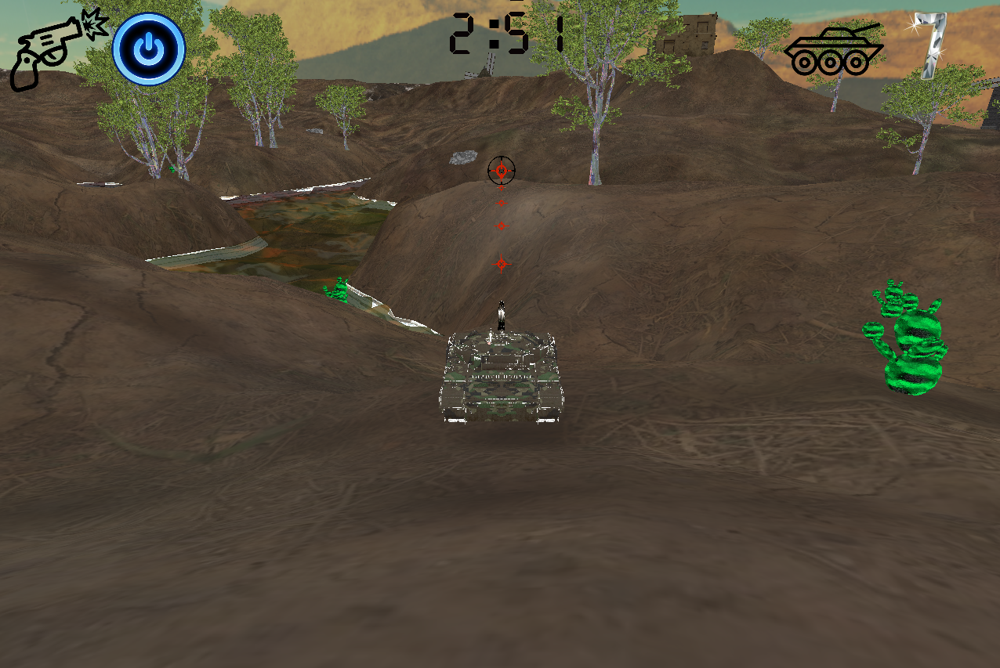
  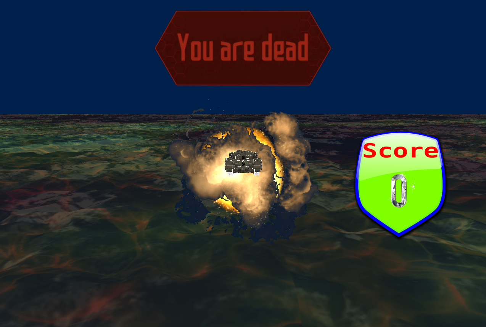
</div>

---

## 구현 항목

### 지형

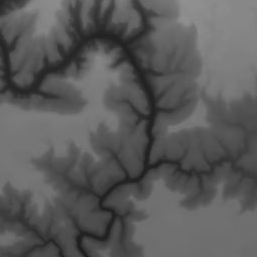

하이트맵으로 지형 메쉬를 생성했습니다.  
알파맵을 이용해 Base, Detail 텍스처를 혼합하는 다중 텍스처 블렌딩 방식을 사용했고, 법선 벡터를 계산해 조명 계산이 가능하도록 했습니다.  
셰이더에서 타이머 값을 받아 **진흙/잔디 텍스처가 10초 간격으로 자동 전환**됩니다.

<br clear="right"/>

<div align="center">
  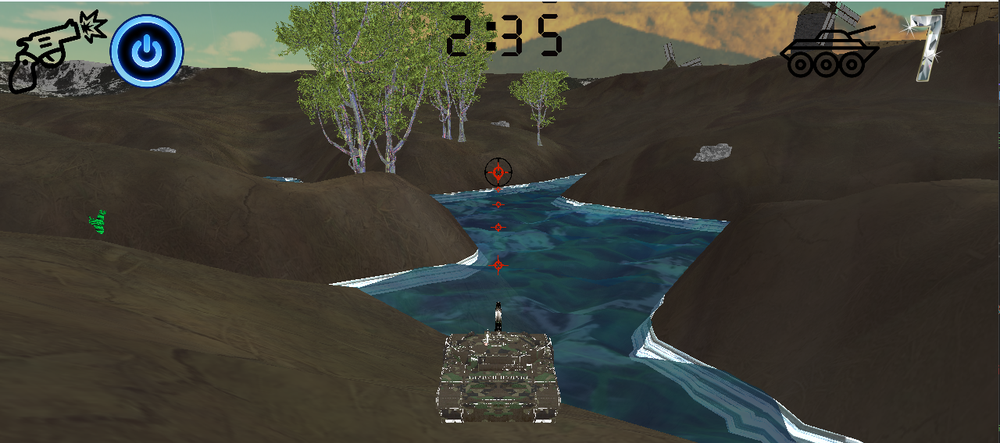
  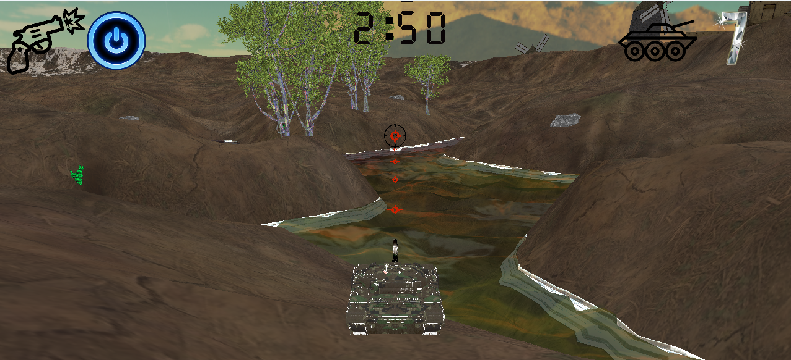
  <br>
  <sub>잔디 상태 (일반) &nbsp;&nbsp;&nbsp;&nbsp;&nbsp;&nbsp;&nbsp;&nbsp;&nbsp;&nbsp;&nbsp;&nbsp;&nbsp;&nbsp;&nbsp;&nbsp;&nbsp;&nbsp;&nbsp;&nbsp;&nbsp;&nbsp;&nbsp;&nbsp;&nbsp;&nbsp;&nbsp;&nbsp;&nbsp;&nbsp;&nbsp;&nbsp;&nbsp;&nbsp;&nbsp;&nbsp;&nbsp;&nbsp; 진흙 상태 (10초 전환)</sub>
</div>

<br>

| 파일 | 용도 |
|------|------|
|  HeightMap | 지형 높이 정보 |
| 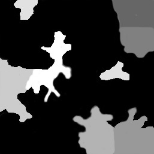 ObjectsMap | 오브젝트 배치 영역 마스크 |

---

### 스카이박스

큐브 메쉬에 큐브 텍스처를 입히는 방식입니다.  
DirectX Texture Tool로 ±X, ±Y, ±Z 6면 이미지를 직접 하나의 DDS 큐브맵 파일로 제작했습니다.  
깊이값의 영향을 받지 않도록 Depth 테스트를 비활성화했습니다.


---

### 물

두 가지 방식으로 구현했습니다.

- **TerrainWater** — 평면 메쉬의 UV를 매 프레임 이동시켜 흐르는 물 표현
- **RippleWater** — 격자 메쉬에서 버텍스 셰이더의 `sin/cos` 연산으로 정점 높이를 변형해 출렁이는 효과 구현

알파 블렌딩으로 반투명 처리를 했고, 올바른 색상 혼합을 위해 불투명 오브젝트를 먼저 렌더링한 뒤 물을 그립니다.  
물에 진입하면 중력이 0이 되어 상하로 부유하는 애니메이션이 재생됩니다.


---

### 플레이어 탱크

Unity에서 T90LP 탱크 모델을 추출했습니다.  
Albedo, Normal, Height, Metalic, Occlusion 텍스처를 DDS로 변환해 각각 적용했습니다.

`FindFrame`으로 바퀴 16개, 터렛, 포신을 개별 오브젝트로 분리해 독립적으로 움직이도록 구성했습니다.

미사일이 포신 방향으로 날아가도록, 포신의 Up/Look 벡터를 외적해 Right 벡터를 구하고 변환 행렬을 만들어 미사일 월드 행렬에 반영했습니다.

카메라는 4가지 모드를 지원하며, 단발 모드에서는 발사 후 카메라가 미사일을 추적합니다. 명중 시 2초간 줌인 상태로 고정됩니다.

<div align="center">
  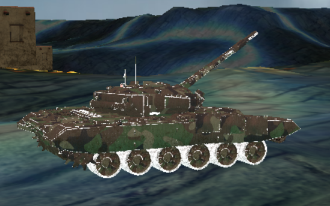
  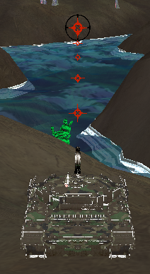
</div>

---

### 적 탱크

적 탱크 7대가 맵 내 랜덤 위치에 배치됩니다.  
1.5초마다 자동으로 미사일을 발사하고, 일정 주기로 방향을 바꾸며 이동합니다.

플레이어와 달리 **지형 경사에 따라 차체가 기울어집니다.**  
현재 Up 벡터와 지형 법선 벡터 사이의 각도를 구해 회전축과 회전량을 계산하고, 선형 보간으로 부드럽게 기울기를 적용했습니다.

<div align="center">
  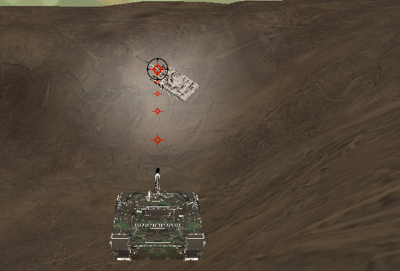
  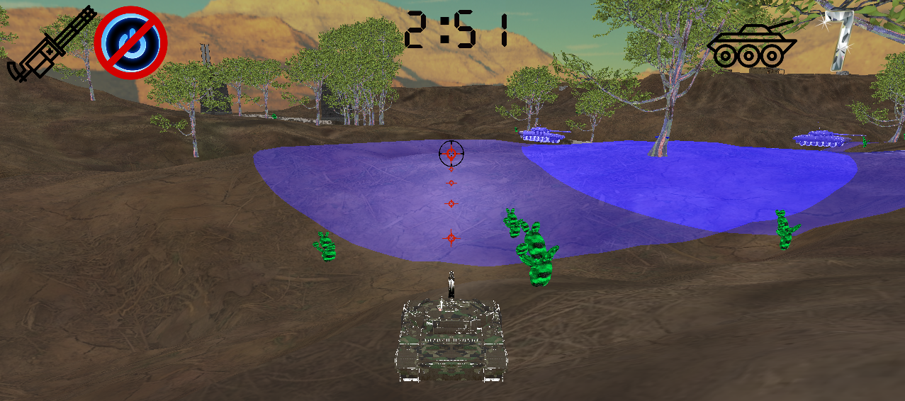
  <br>
  <sub>경사에 따라 기울어지는 적 탱크 &nbsp;&nbsp;&nbsp;&nbsp;&nbsp;&nbsp;&nbsp;&nbsp;&nbsp;&nbsp;&nbsp;&nbsp;&nbsp;&nbsp;&nbsp;&nbsp;&nbsp;&nbsp;&nbsp;&nbsp;&nbsp;&nbsp;&nbsp;&nbsp;&nbsp;&nbsp;&nbsp;&nbsp;&nbsp;&nbsp; R키 — 적 위치 파란 조명으로 탐지</sub>
</div>

---

### 충돌 처리

- 플레이어 ↔ 건물, 돌, 선인장: AABB 방식
- Unity에서 1x1x1 큐브를 기준으로 각 오브젝트의 충돌 범위를 측정해 설정했습니다
- 돌은 계속 밀면 밀려나고, 선인장은 밟으면 납작해지는 애니메이션이 재생됩니다
- 미사일은 지형 높이 아래로 내려가거나 사거리를 초과하면 초기화됩니다

<div align="center">
  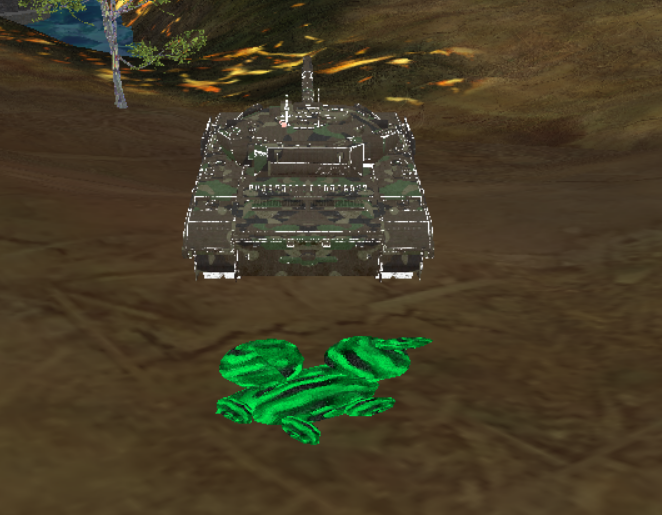
</div>

---

### 스프라이트 애니메이션

8x8 프레임 구성의 폭발 스프라이트 시트를 사용합니다.  
텍스처 행렬을 상수 버퍼로 셰이더에 전달하고, 픽셀 셰이더에서 UV 오프셋을 계산해 프레임을 순서대로 재생합니다.  
적 피격 시 3가지 폭발 스프라이트가 동시에 활성화됩니다.

<div align="center">
  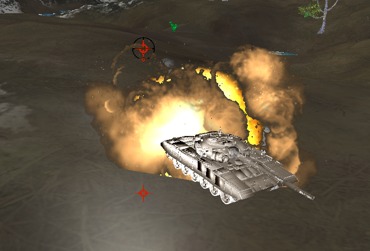
</div>

---

### 나무 / 건물 / 기타 오브젝트

- 나무 40개(단일 30 + 묶음 10), 물 영역을 제외한 랜덤 위치에 배치
- 알파 블렌딩 + AlphaToCoverage로 잎사귀 경계를 자연스럽게 처리
- 건물 20개, 굴곡이 심한 지형은 피해서 배치 (주변 높이 차이 검사 함수 사용)
- WindMill 건물은 날개가 자동으로 회전

<div align="center">
  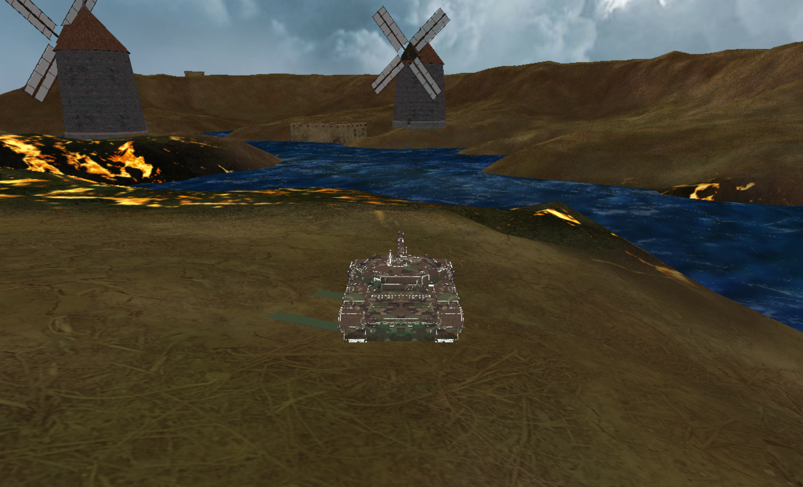
  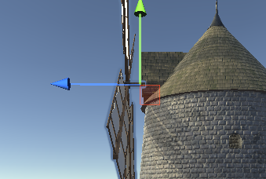
  <br>
  <sub>WindMill · 물 · 지형이 함께 보이는 인게임 장면 &nbsp;&nbsp;&nbsp;&nbsp;&nbsp;&nbsp;&nbsp;&nbsp;&nbsp;&nbsp;&nbsp;&nbsp;&nbsp;&nbsp;&nbsp;&nbsp;&nbsp; Unity에서 추출한 WindMill 모델</sub>
</div>

---

### 조명

| 종류 | 용도 |
|------|------|
| Directional Light | 전체 환경 조명 |
| Spot Light | 포신 앞 방향 조명 |
| Point Light | 엔딩 씬 연출 |
| Point Enemy Light (커스텀) | R키 입력 시 적 주변을 파란 영역으로 시각화 |

<div align="center">
  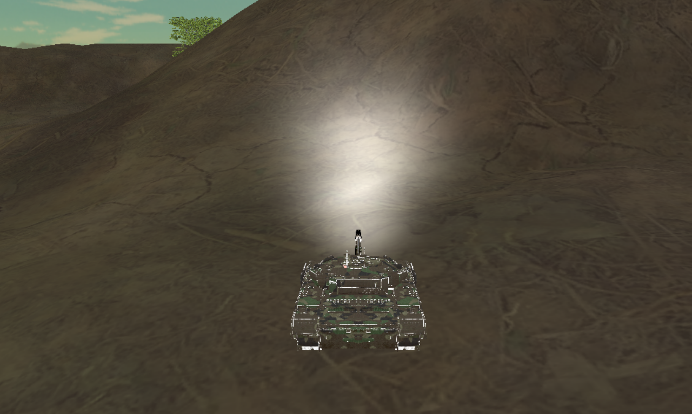
  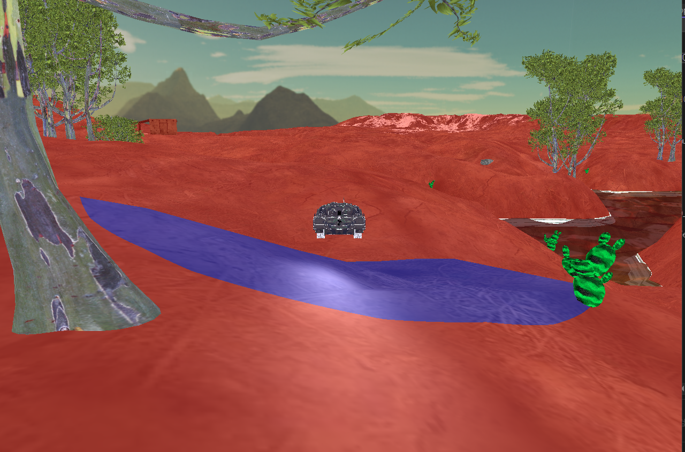
  <br>
  <sub>Spot Light — 포신 앞 방향 조명 &nbsp;&nbsp;&nbsp;&nbsp;&nbsp;&nbsp;&nbsp;&nbsp;&nbsp;&nbsp;&nbsp;&nbsp;&nbsp;&nbsp;&nbsp;&nbsp;&nbsp;&nbsp;&nbsp;&nbsp;&nbsp;&nbsp;&nbsp;&nbsp;&nbsp;&nbsp;&nbsp;&nbsp;&nbsp;&nbsp;&nbsp;&nbsp;&nbsp;&nbsp;&nbsp;&nbsp;&nbsp;&nbsp; Point Light — 엔딩 씬 연출</sub>
</div>

---

### UI

<div align="center">
  
  &nbsp;&nbsp;
  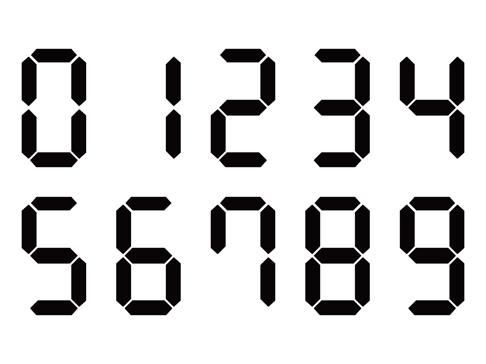
  &nbsp;&nbsp;
  
  &nbsp;&nbsp;
  
  &nbsp;&nbsp;
  
</div>
<br>

Direct2D11on12 방식으로 DirectX 12 위에 2D UI를 렌더링했습니다.

- 디지털 숫자 스프라이트에서 초 단위마다 출력 영역을 계산해 카운트다운 타이머를 구현했습니다
- 격파한 탱크 수, 단발/연발 모드, R키 쿨타임 등을 실시간으로 표시합니다
- 시작 씬 / 인게임 / 엔딩 씬마다 별도 UI가 구성되어 있습니다

<div align="center">
  
</div>

---

### 사운드

FMOD 라이브러리를 사용했습니다.  
폭발 효과음은 루프 방식으로 관리하되, WAV 파일을 2.5초로 편집해 매 피격 시 처음부터 깔끔하게 재생되도록 처리했습니다.

---

### 렌더링 구조

초기에는 셰이더 객체마다 디스크립터 힙을 개별 생성했으나, 오브젝트가 늘어나면서 `DrawIndexedInstanced` 경고와 프레임 드롭이 발생했습니다.  
디스크립터 힙을 Scene 단위로 통합 관리하는 방식으로 변경해 문제를 해결했습니다.

---

## 엔딩 씬

<div align="center">
  
  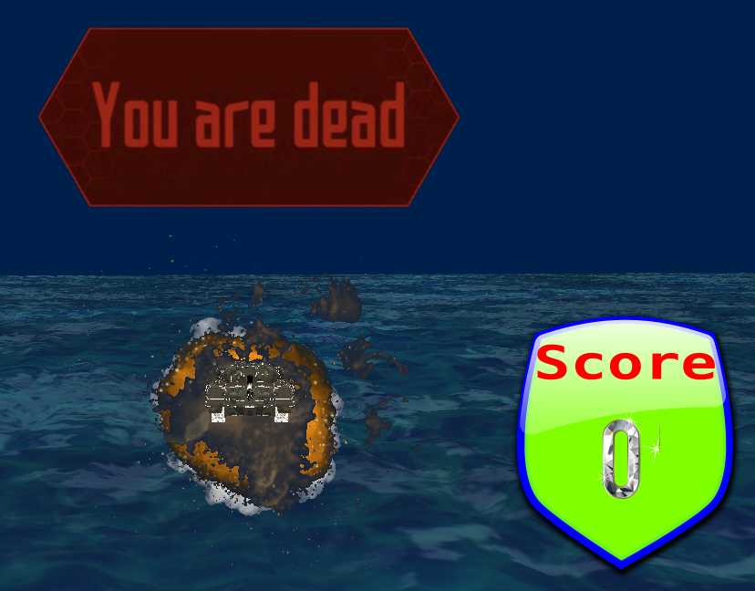
</div>

---

## 파일 구조

```
3DGP2_Assignment01/
├── GameFramework.cpp/h     # 메인 루프, 윈도우 생성, Direct2D 초기화
├── Scene.cpp/h             # 씬 관리, 오브젝트 생성, 충돌 처리, 디스크립터 힙
├── Object.cpp/h            # 게임 오브젝트 기반 클래스
├── Player.cpp/h            # 플레이어, 미사일, 카메라 연동
├── Camera.cpp/h            # 카메라 모드별 처리
├── Mesh.cpp/h              # 지형, 격자, 빌보드, 물 메쉬
├── Shader.cpp/h            # 셰이더 및 PSO 관리
├── Shaders.hlsl            # 버텍스 / 픽셀 셰이더
├── Light.hlsl              # 조명 계산
├── UILayer.cpp/h           # Direct2D UI 레이어
├── GameSound.cpp/h         # FMOD 사운드
├── Timer.cpp/h             # 게임 타이머
├── Image/                  # UI 이미지 리소스
├── Model/                  # 3D 모델 파일
├── Skybox/                 # 스카이박스 텍스처
└── Sound/                  # 사운드 파일
```
